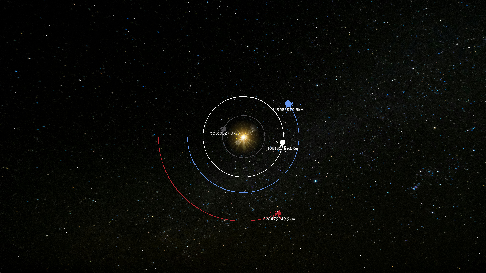

# PlanetSimulation
A planetary simulation using Pygame, complete with twinkling stars and orbiting planets

# Planet Simulation 🌍🪐🌟



A simple planetary simulation using Pygame. This project simulates the motion of planets in a solar system with realistic gravity and particle effects, and includes background music for an immersive experience.

## Features

- **Twinkling Stars**: Randomly generated stars that twinkle with varying brightness to create a dynamic cosmic background.
- **Planetary Motion**: Realistic simulation of planetary orbits based on gravitational forces between celestial bodies.
- **Particle Effects**: Planets emit particles as they move, creating visually appealing trails behind them.
- **Background Music**: Atmospheric music plays continuously in the background to enhance the simulation's ambiance.

- **Simulate Toggle**: Users can toggle the simulation of individual planets (ON/OFF) via the UI.
- **Editable Planet Mass**: The mass of each planet can be modified during the simulation, with real-time updates on its orbital behavior.
- **Multiple Planet Selection**: Easily switch between planets using keyboard controls to view and modify different celestial bodies.

## Installation

1. Clone the repository:

    ```bash
    git clone https://github.com/your-username/PlanetSimulation.git
    cd PlanetSimulation
    ```

2. Install the required dependencies:

    ```bash
    pip install -r requirements.txt
    ```

3. Make sure the `imgs` and `music` folders are populated with the correct assets (images and music).

## Usage

To run the simulation, execute the `main.py` file:

```bash
python main.py
